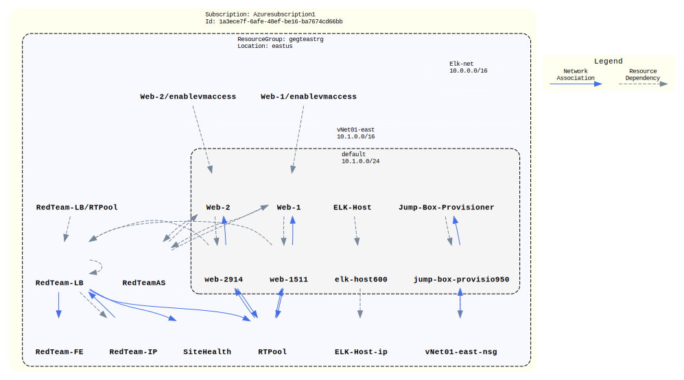
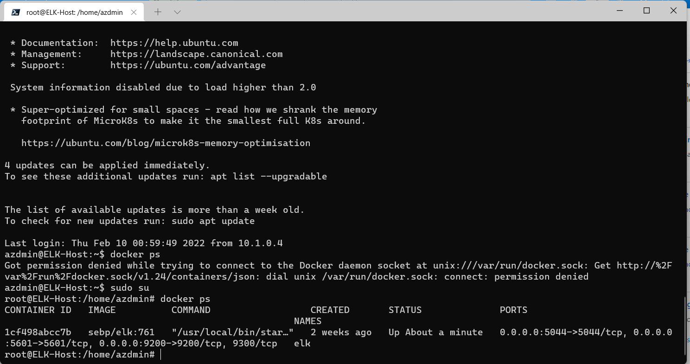

## Automated ELK Stack Deployment

The files in this repository were used to configure the network depicted below.

These files have been tested and used to generate a live ELK deployment on Azure. They can be used to either recreate the entire deployment pictured above. Alternatively, select portions of the playbook files may be used to install only certain pieces of it, such as Filebeat.

  [Ansible Playbooks][1]

This document contains the following details:
- Description of the Topologu
- Access Policies
- ELK Configuration
  - Beats in Use
  - Machines Being Monitored
- How to Use the Ansible Build

### Description of the Topology

The main purpose of this network is to expose a load-balanced and monitored instance of DVWA, the D*mn Vulnerable Web Application.

Load balancing ensures that the application will be highly available, in addition to restricting access to the network.
- What aspect of security do load balancers protect? 
- They filter the traffic and only allow access to specific resources on the network.
- What is the advantage of a jump box? 
- It reduces the surface area of attack by allowing a single point of entry to the network

Integrating an ELK server allows users to easily monitor the vulnerable VMs for changes to the file system and system metric.
- Filebeat collects data about the file system.
- Metricbeat collects machine metrics, such
as uptime.

The configuration details of each machine may be found below.

|   Name   | Function | IP Address | Operating System |   |
|:--------:|:--------:|:----------:|:----------------:|---|
| Jump Box | Gateway  | 10.1.0.4   | Linux            |   |
| Web-1    | Webhost  | 10.1.0.5   | Linux            |   |
| Web-2    | Webhost  | 10.1.0.6   | Linux            |   |
| ELK Host | ELK Host | 10.0.0.4   | Linux            |   |

### Access Policies

The machines on the internal network are not exposed to the public Internet. 

Only the jump box and the ELK Host machine can accept connections from the Internet. Access to this machine is only allowed from the following IP addresses:
- My ISP assigned IP

Machines within the network can only be accessed by other machines in the vNet or that are peered to the vNet.

Which machine did you allow to access your ELK VM? What was its IP address?
- My ISP assigned IP

A summary of the access policies in place can be found in the table below.

|   Name   | Publicly Accessible |   Allowed Internal IPs   | Allowed Public IPs |
|:--------:|:-------------------:|:------------------------:|--------------------|
| Jump Box | Yes                 | 10.1.0.0/24, 10.0.0.0/24 | My ISP IP          |
| Web-1    | No                  | 10.1.0.0/24, 10.0.0.0/24 |                    |
| Web-2    | No                  | 10.1.0.0/24, 10.0.0.0/24 |                    |
| ELK Host | Yes                 | 10.1.0.0/24, 10.0.0.0/24 | My ISP IP          |

### Elk Configuration

Ansible was used to automate configuration of the ELK machine. No configuration was performed manually, which is advantageous because...
- What is the main advantage of automating configuration with Ansible?
- It allows for a well defined repeatable process to install and configure applications

The playbook implements the following tasks:
- Install docker.io
- Install pip3
- Install docker python module
- Increase the amount of memory used in the container
- Download and launch a docker elk container
- Set docker to start on system start

The following screenshot displays the result of running `docker ps` after successfully configuring the ELK instance.

### Target Machines & Beats
This ELK server is configured to monitor the following machines:
- IPs being monitored are 10.1.0.5 and 10.1.0.6

We have installed the following Beats on these machines:
- FileBeats and MetricBeats have been installed

These Beats allow us to collect the following information from each machine:
- _TODO: In 1-2 sentences, explain what kind of data each beat collects, and provide 1 example of what you expect to see. E.g., `Winlogbeat` collects Windows logs, which we use to track user logon events, etc._

### Using the Playbook
In order to use the playbook, you will need to have an Ansible control node already configured. Assuming you have such a control node provisioned: 

SSH into the control node and follow the steps below:
- Copy the install-elk.yml file to /etc/ansible.
- Update the ansible hosts file to include the ip address of the elk server
- Run the playbook, and navigate to curl http://10.0.0.4:5601/app/kibana to check that the installation worked as expected.

_TODO: Answer the following questions to fill in the blanks:_
- _Which file is the playbook? Where do you copy it?_
- _Which file do you update to make Ansible run the playbook on a specific machine? How do I specify which machine to install the ELK server on versus which to install Filebeat on?_
- _Which URL do you navigate to in order to check that the ELK server is running?

_As a **Bonus**, provide the specific commands the user will need to run to download the playbook, update the files, etc._

  [1]: Scripts/ansible/filebeat-playbook.yml
